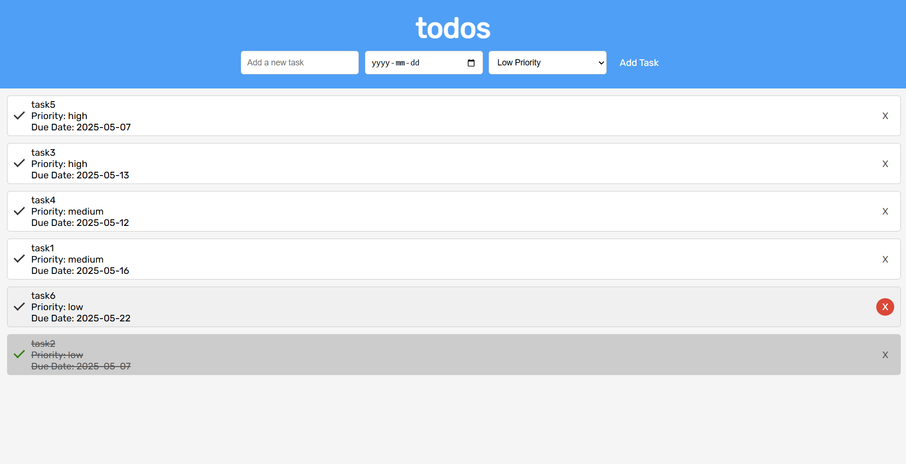

# 📸 Creative Gallery To-Do App

This is a creative and minimalist **To-Do List Web App** that allows users—especially artists, photographers, and creators—to manage their tasks in a visually clean and interactive way. Originally built in **November 2023** and published in **May 2025**, the purpose of this web application is to encourage productivity while serving as a companion for creative minds who need to track their daily tasks, deadlines, and priorities.

## 🌟 Features

- 📝 Add tasks with:
  - Custom descriptions
  - Due dates
  - Priority levels (Low, Medium, High)
- ✅ Mark tasks as completed
- ❌ Delete tasks easily
- 🔄 Persist tasks using **LocalStorage**
- 📊 Tasks sorted automatically by priority (High → Low)

## ⚙️ Built With

- HTML5, CSS3, JavaScript (Vanilla)
- Google Fonts (`Rubik`)
- LocalStorage for task persistence
- Future expansion: MySQL database support

## 🖼️ Screenshots

